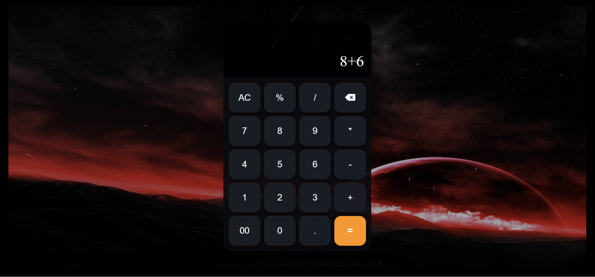

# 🧮 React Calculator

A simple calculator built with **React.js** to practice React fundamentals.

## Features

* Basic calculations `+ - × ÷`
* Percentage `%`
* Decimal numbers
* Clear `AC`
* Backspace
* Dynamic display

## Tech Used

* React.js
* JavaScript
* CSS
* Vite
* Font Awesome

## Run Locally

```bash
npm install
npm run dev
```

## React Concepts

* `useState`
* Props
* Event handling
* `.map()`
* Conditional rendering
* Components

## Screenshots



## Author

**Rahul Parmar**
